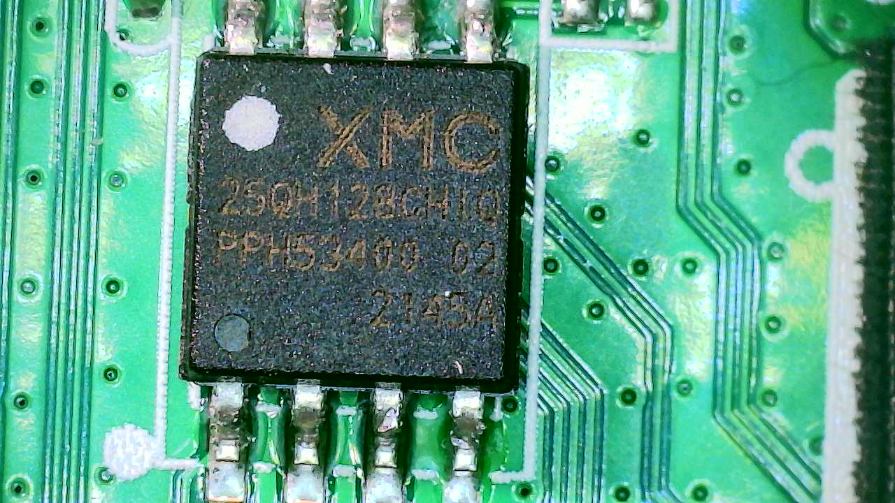
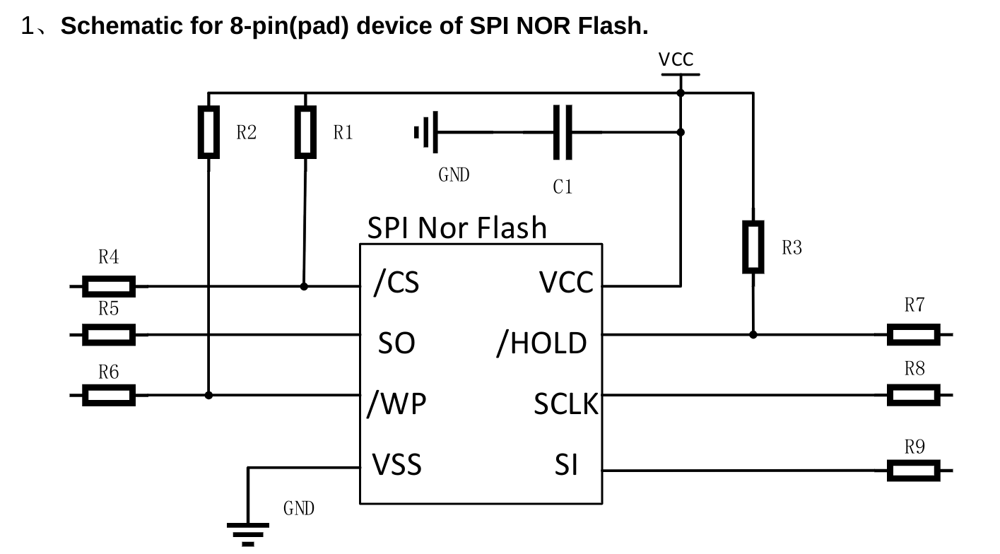

# (Im)PerfectProject(or)


A few years ago I bought a low-quality projector from Amazon so I could watch movies in my room. To be honest, it works pretty well, has a decent brightness, and has like five different ways you can stream video/audio to it, so I can't complain too much.

It does have an interesting mode of operation, where it broadcasts a WiFi network you can connect to, and then start controlling the device via a web interface. So what I'm seeing is: perfect hacking target.

> Note: Because I am *silly*, I didn't take any pictures of the user interface with the projector before I accidentally damaged the ribbon cable for the lens.

## Reconnaissance

Let's start looking around! Step one for networked IoT devices is always doing an `nmap` scan:

```bash
$ sudo nmap -sV -O -A -p- 10.0.0.227 | tee nmap.projector.txt
Starting Nmap 7.93 ( https://nmap.org ) at 2023-12-28 16:56 EST
Nmap scan report for 10.0.0.227
Host is up (0.012s latency).
Not shown: 65534 closed tcp ports (reset)
PORT   STATE SERVICE VERSION
80/tcp open  http    Boa HTTPd 0.94.13
|_http-title: Lollipop wifi
|_http-server-header: Boa/0.94.13
MAC Address: 08:6F:48:97:FD:D0 (Shenzhen iComm Semiconductor)
Device type: general purpose
Running: Linux 4.X
OS CPE: cpe:/o:linux:linux_kernel:4.4.2
OS details: DD-WRT v3.0 (Linux 4.4.2)
Network Distance: 1 hop

TRACEROUTE
HOP RTT      ADDRESS
1   11.56 ms 10.0.0.227

OS and Service detection performed. Please report any incorrect results at https://nmap.org/submit/ .
Nmap done: 1 IP address (1 host up) scanned in 22.13 seconds
```

So looks like our only attack surface will be the web interface. The web server uses "Common Gateway Interface" (CGI) patterns for doing anything on the system. For example, to control the media (i.e. send pause, play, volume controls) you would visit `/cgi-bin/media.cgi`.

I looked up the "boa" web server, and it looks like it's a fairly old, relatively-discontinued web server. There's a few vulnerabilities and CVEs out for it, but they tend to be disputed and application-specific, not targetting the actual webserver. So, I'm not going to try too hard to actually inspect the server.

I want to find out what other CGI scripts exist, that just aren't linked via the web pages I've found. It's time to break out `wfuzz` and see if we get any hits! I cloned the repository to get their wordlists and ran it against a few of them to get these results:

```bash
$ cat wfuzz/wordlist/general/admin-panels.txt wfuzz/wordlist/general/megabeast.txt wfuzz/wordlist/vulns/cgis.txt wfuzz/wordlist/vulns/dirTraversal-nix.txt > wordlist.txt
$ wfuzz -w wordlist.txt --hc 404 http://10.0.0.227/cgi-bin/FUZZ\{scan\}.cgi | tee wfuzz.projector.txt 
********************************************************
* Wfuzz 3.1.0 - The Web Fuzzer                         *
********************************************************

Target: http://10.0.0.227/cgi-bin/FUZZ.cgi
Total requests: 49759

=====================================================================
ID           Response   Lines    Word       Chars       Payload                                                                    
=====================================================================

000000001:   200        210 L    425 W      9661 Ch     "scan"                                                                     
000009803:   200        1 L      7 W        80 Ch       "connect"                                                                  
000011646:   200        6 L      7 W        77 Ch       "debug"                                                                    
000012622:   200        4 L      9 W        119 Ch      "dialog"                                                                   
000013010:   502        4 L      13 W       131 Ch      "disconnect"                                                               
000017401:   502        4 L      13 W       131 Ch      "forget"                                                                   
000020416:   200        16 L     33 W       449 Ch      "home"                                                                     
000023441:   200        4 L      6 W        64 Ch       "key"                                                                      
000023876:   200        1 L      5 W        82 Ch       "language"                                                                 
000029796:   200        1 L      5 W        82 Ch       "password"                                                                 
000036182:   200        228 L    461 W      10570 Ch    "scan"                                                                     
000041421:   200        0 L      1 W        45 Ch       "test"                                                                     
000045596:   403        4 L      18 W       168 Ch      "%00/"                                                                     
000045595:   403        4 L      18 W       168 Ch      "%00"                                                                      
000048203:   200        1 L      5 W        82 Ch       "password"                                                                 
000048733:   200        0 L      1 W        45 Ch       "test"                                                                     
000049739:   403        4 L      18 W       168 Ch      "%00../%00../%00../etc/passwd"                                             
000049738:   403        4 L      18 W       168 Ch      "%00../%00../etc/passwd"                                                   
000049737:   403        4 L      18 W       168 Ch      "%00../etc/passwd"                                                         
000049742:   403        4 L      18 W       168 Ch      "%00../%00../%00../%00../%00../%00../etc/passwd"                           
000049740:   403        4 L      18 W       168 Ch      "%00../%00../%00../%00../etc/passwd"                                       
000049746:   403        4 L      18 W       169 Ch      ".%00./.%00./etc/passwd"                                                   
000049754:   403        4 L      18 W       170 Ch      "..%00/..%00/etc/passwd"                                                   
000049753:   403        4 L      18 W       170 Ch      "..%00/etc/passwd"                                                         
000049760:   403        4 L      18 W       170 Ch      "..%00/..%00/..%00/..%00/..%00/..%00/..%00/..%00/etc/passwd"               
000049759:   403        4 L      18 W       170 Ch      "..%00/..%00/..%00/..%00/..%00/..%00/..%00/etc/passwd"                     
000049758:   403        4 L      18 W       170 Ch      "..%00/..%00/..%00/..%00/..%00/..%00/etc/passwd"                           
000049757:   403        4 L      18 W       170 Ch      "..%00/..%00/..%00/..%00/..%00/etc/passwd"                                 
000049756:   403        4 L      18 W       170 Ch      "..%00/..%00/..%00/..%00/etc/passwd"                                       
000049755:   403        4 L      18 W       170 Ch      "..%00/..%00/..%00/etc/passwd"                                             
000049745:   403        4 L      18 W       169 Ch      ".%00./etc/passwd"                                                         
000049751:   403        4 L      18 W       169 Ch      ".%00./.%00./.%00./.%00./.%00./.%00./.%00./etc/passwd"                     
000049752:   403        4 L      18 W       169 Ch      ".%00./.%00./.%00./.%00./.%00./.%00./.%00./.%00./etc/passwd"               
000049750:   403        4 L      18 W       169 Ch      ".%00./.%00./.%00./.%00./.%00./.%00./etc/passwd"                           
000049749:   403        4 L      18 W       169 Ch      ".%00./.%00./.%00./.%00./.%00./etc/passwd"                                 
000049748:   403        4 L      18 W       169 Ch      ".%00./.%00./.%00./.%00./etc/passwd"                                       
000049747:   403        4 L      18 W       169 Ch      ".%00./.%00./.%00./etc/passwd"                                             
000049741:   403        4 L      18 W       168 Ch      "%00../%00../%00../%00../%00../etc/passwd"                                 
000049743:   403        4 L      18 W       168 Ch      "%00../%00../%00../%00../%00../%00../%00../etc/passwd"                     
000049744:   403        4 L      18 W       168 Ch      "%00../%00../%00../%00../%00../%00../%00../%00../etc/passwd"               

Total time: 0
Processed Requests: 49743
Filtered Requests: 49703
Requests/sec.: 0
```

This actually found a few endpoints that I didn't see by looking at the HTML of the pages I had already seen. I played around with a few of these, but didn't find anything *too* interesting. Of note are:

```bash
$ curl -vvv http://10.0.0.227/cgi-bin/test.cgi           
*   Trying 10.0.0.227:80...
* Connected to 10.0.0.227 (10.0.0.227) port 80 (#0)
> GET /cgi-bin/test.cgi HTTP/1.1
> Host: 10.0.0.227
> User-Agent: curl/7.88.1
> Accept: */*
> 
* HTTP 1.0, assume close after body
< HTTP/1.0 200 OK
< Date: Thu, 01 Jan 1970 00:26:52 GMT
< Server: Boa/0.94.13
< Connection: close
< Content-type: text/html
< 
* Closing connection 0
<HTML><HEAD><TITLE>Test</TITLE></HEAD></HTML>
$ curl -vvv http://10.0.0.227/cgi-bin/debug.cgi
*   Trying 10.0.0.227:80...
* Connected to 10.0.0.227 (10.0.0.227) port 80 (#0)
> GET /cgi-bin/debug.cgi HTTP/1.1
> Host: 10.0.0.227
> User-Agent: curl/7.88.1
> Accept: */*
> 
* HTTP 1.0, assume close after body
< HTTP/1.0 200 OK
< Date: Thu, 01 Jan 1970 00:27:20 GMT
< Server: Boa/0.94.13
< Connection: close
< Content-type: text/html
< 
<HTML><BODY>
<HEAD>
<TITLE>Debug</TITLE>
</HEAD>
ADB enabled!
</BODY></HTML>
* Closing connection 0
```

You can see when you hit `debug.cgi` it'll say that the ADB is enabled. The only ADB I know of is the Android Debug Build, which I wouldn't expect on this device since it should be an embedded Linux device... I actually tried connecting to the projector using adb, but it didn't work:

```bash
$ ~/Desktop/Tools/platform-tools/adb connect 10.0.0.227:5037
failed to connect to '10.0.0.227:5037': Connection refused
$ ~/Desktop/Tools/platform-tools/adb connect 10.0.0.227     
failed to connect to '10.0.0.227:5555': Connection refused
```

## The Hardware

It's time to open this sucker up, let's see if there is UART or some other serial communication mechanism. Now, this is where I messed up, *just a little bit*, and accidentally severed one of the connections on the ribbon cable that connects the actual projector lens to the board. The projector still turns on, but it's just a blank white screen now. Whoops! You can see below an image of the main board, as well as some annotations, below.


### Getting UART

Anyway, after opening up the top, I noticed three pins labelled RX, TX, and GND. Pretty indicative of UART, but we'll need to connect to it first to make sure. Unfortunately, there weren't any header pins soldered on to it, so I'll have to do that first. After my incredibly shoddy solder job, I have everything hooked up.


Let's check out what comes through using `minicom`, it's fairly verbose, so I included just some interesting parts of the startup sequence:

```bash
$ sudo minicom --dev /dev/ttyUSB0 --capturefile minicom.projector.txt
##  Booting kernel from Legacy Image at 22000000 ...
   Image Name:   MVX4##I2M#g#######KL_LX409##[BR:
   Image Type:   ARM Linux Kernel Image (lzma compressed)
   Data Size:    2132140 Bytes = 2 MiB
   Load Address: 20008000
   Entry Point:  20008000
   Verifying Checksum ... OK
-usb_stop(USB_PORT0)
-usb_stop(USB_PORT1)
-usb_stop(USB_PORT2)
   Uncompressing Kernel Image ... 
[XZ] !!!reserved 0x21000000 length=0x 1000000 for xz!!
   XZ: uncompressed size=0x446000, ret=7
OK
atags:0x20000000

Starting kernel ...

Booting Linux on physical CPU 0x0
Linux version 4.9.84 (bill@ubuntu) (gcc version 8.2.1 20180802 (GNU Toolchain for the A-profile Architecture 8.2-2018-08 (arm-rel-8.23)) ) #2 SMP PREEMPT Mon Aug 8 15:00:20 CST 2022
CPU: ARMv7 Processor [410fc075] revision 5 (ARMv7), cr=50c5387d
CPU: div instructions available: patching division code
CPU: PIPT / VIPT nonaliasing data cache, VIPT aliasing instruction cache
cma: Reserved 2 MiB at 0x27200000
Memory policy: Data cache writealloc
percpu: Embedded 14 pages/cpu @c70bc000 s25112 r8192 d24040 u57344
Built 1 zonelists in Zone order, mobility grouping on.  Total pages: 15874
Kernel command line: console=ttyS0,115200 root=/dev/mtdblock3 rootfstype=squashfs ro init=/linuxrc LX_MEM=0x7f00000 mma_heap=MMU_MMA,miu=0,sz=0x3800000 mma_heap=mma_heap_name0,miu=0,sz=0x0800000 mma_memblock_remove=1 mmap_reserved=fb,miu=0,sz=0x300000,max_start_off=0x7C00000,max_end_off=0x7F00000
PID hash table entries: 256 (order: -2, 1024 bytes)
Dentry cache hash table entries: 8192 (order: 3, 32768 bytes)
Inode-cache hash table entries: 4096 (order: 2, 16384 bytes)
Memory: 54020K/64512K available (2489K kernel code, 259K rwdata, 1312K rodata, 168K init, 155K bss, 8444K reserved, 2048K cma-reserved)
Virtual kernel memory layout:
    vector  : 0xffff0000 - 0xffff1000   (   4 kB)
    fixmap  : 0xffc00000 - 0xfff00000   (3072 kB)
    vmalloc : 0xc8000000 - 0xff800000   ( 888 MB)
    lowmem  : 0xc0000000 - 0xc7f00000   ( 127 MB)
    modules : 0xbf800000 - 0xc0000000   (   8 MB)
      .text : 0xc0008000 - 0xc0276718   (2490 kB)
      .init : 0xc03e2000 - 0xc040c000   ( 168 kB)
      .data : 0xc040c000 - 0xc044cfe8   ( 260 kB)
       .bss : 0xc044e000 - 0xc0474c10   ( 156 kB)
SLUB: HWalign=64, Order=0-3, MinObjects=0, CPUs=2, Nodes=1
Creating 7 MTD partitions on "NOR_FLASH":
0x000000000000-0x000000060000 : "BOOT"
0x000000060000-0x000000270000 : "KERNEL"
0x000000270000-0x000000290000 : "LOGO"
0x000000290000-0x000000410000 : "rootfs"
0x000000410000-0x000000730000 : "miservice"
0x000000730000-0x000000f00000 : "customer"
0x000000f00000-0x000001000000 : "appconfigs"
[01/Jan/1970:00:00:12 +0000] boa: server version Boa/0.94.13
[01/Jan/1970:00:00:12 +0000] boa: server built Nov 20 2020 at 15:01:28.
[01/Jan/1970:00:00:12 +0000] boa: starting server pid=801, port 80
###sd20x_start_otaclient line 639 ota_host[43.254.2.156:8000/ota/htc/v53/sd203_SSV6X5X]
###sd20x_ota_download line 506 lollipop OTA[43.254.2.156:8000/ota/htc/v53/sd203_SSV6X5X]...
###fw_download line 77 prepare to download http://43.254.2.156:8000/ota/htc/v53/sd203_SSV6X5X/config.txt to /tmp/config.txt...
###fw_download line 79 connecting...
###fw_download line 81 fetching file size...
!!!sd20x_ota_download line 509 Download config.txt failed!
```

We can start to understand a little bit more about the device given this output. We know it's an ARM Linux device, its firmware is packed using squashfs. There are a few partitions in the SPI NOR Flash chip. And interestingly, it seems to attempt Over the Air updates by reaching out to `http://43.254.2.156:8000/ota/htc/v53/config.txt`. Let's look at this a little bit more.

The IP maps to `ecs-43-254-2-156.compute.hwclouds-dns.com` which is Huawei Cloud's DNS servers. I imagine this is pretty similar to Amazon's EC2 DNS names. If we go to the parent directory of the `config.txt`, we can keep navigating up the directory tree until we find a few other firmware types. I have *no* idea what devices these correspond to, but after some searching, I found an existing [`config.txt`](http://43.254.2.156:8000/ota/yg/v53/sd203_RTL8731AU/), along side two files: `otaunpack` and `sd203ota.bin.gz`. The configuration file seems to include some versioning information, and the MD5 hashes of the update and the `otaunpack` binary. I'm going to *guess* that the `otaunpack` binary does the unpacking and writing to the SPI NOR Flash chip.

```ini
major_version=1
middle_version=1
minor_version=28
suffix_version=RCB35
release_date=
force_update=false
MD5=678254f11abb56dc03dd28ebd214a6fe
MD5_OTA=5d5ed480e0061efcf1df14870a1bd952
```

I'm starting to wonder if I can force my own OTA by ARP Poisoning the network and advertising that IP Address as my own... Anyway, I'll look into that later. I want to try dumping the firmware from the Flash chip, but truth be told, my SOIC8 doesn't get here until tomorrow. You know what that means... hand-jamming a bunch of components that shouldn't be in the same solution to get something that half works (⌐▨_▨).

### Dumping the Firmware

I have some Salae test-hooks, some cables, and a Flipper Zero. There's an app for the Flipper Zero that is specifically meant to read SPI Flash memory, so I'll be using that. First, we have to figure out the pin orientation/what the pins correspond to. Let's get a nice close up image of the chip and see if we can find a reference sheet for it.



I tried my best to read the text off the chip, and googled "XMC 25OH128" which brought me to the manufacturer's website, and lead me to the [chip's page](https://www.xmcwh.com/en/site/product_con/202). On the page it lists the reference schematic, which is necessary in order to figure out the how to wire it properly to the Flipper Zero.



This is great and all, but what it doesn't tell me is the orientation of the chip, i.e. is the white dot on the chip the `CS` or the `SI`? I ended up pulling their actual [Data Sheet](https://www.xmcwh.com/uploads/801/XM25QH128C_Ver2.1.pdf) which proved to be *much* more useful.

First, we have to figure out some information from the rest of the characters on the physical chip itself, as this will tell us the chip layout. Using the "Ordering Information" diagram from the Data Sheet:


We read from the physical chip "XMC25QH128CH"

Now that we know it's Package Code H (SOP 208mil 8L), we know that we're using Figure 2a. Note that these figures actually contain the dot that we see on the physical chip, so we can orient ourselves.


Okay, let's get some of the test-hooks onto the legs of the Flash chip, connect the wires to the hooks, and finally plug it all into our Flipper Zero. The [SPI Mem Manager](https://lab.flipper.net/apps/spi_mem_manager) app comes with a wiring guide:


I got the FlipperZero all wired up, but the screen just sits at "Detecting SPI Chip...". I looked at the source for the SPI Mem Manager, and saw that the [XMC25QH128CH might not be supported](https://github.com/flipperdevices/flipperzero-good-faps/blob/3322caaeb25e1fa50d55f864ba2034b2c8b09292/spi_mem_manager/lib/spi/spi_mem_chip_arr.c#L1401)... Bummer. I'll have a go again tomorrow when my SOIC8 gets in the mail.


